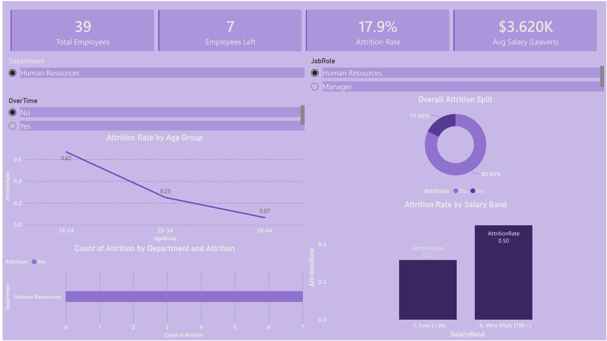
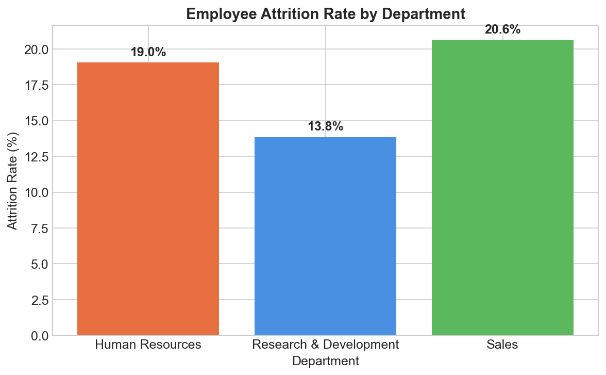
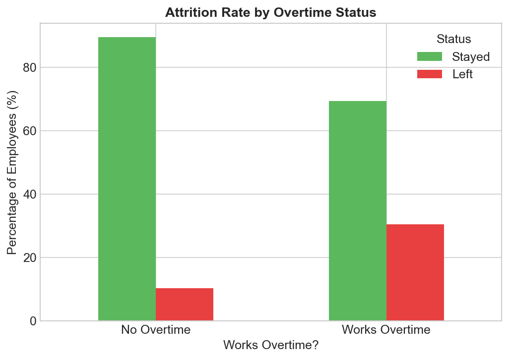
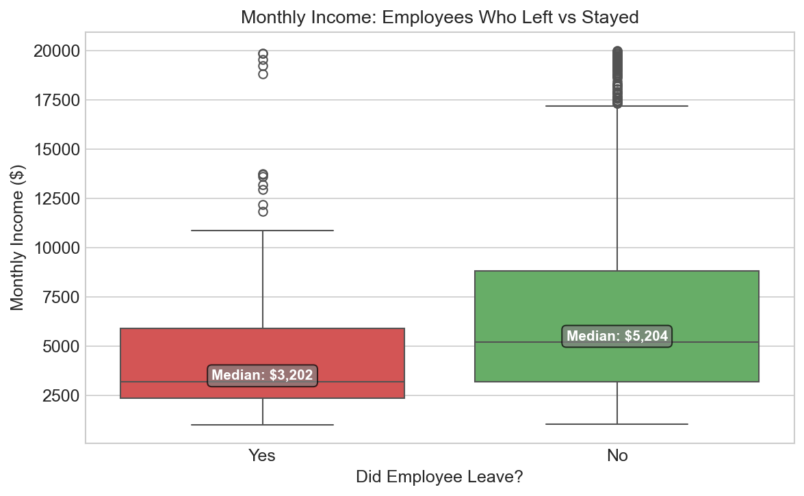
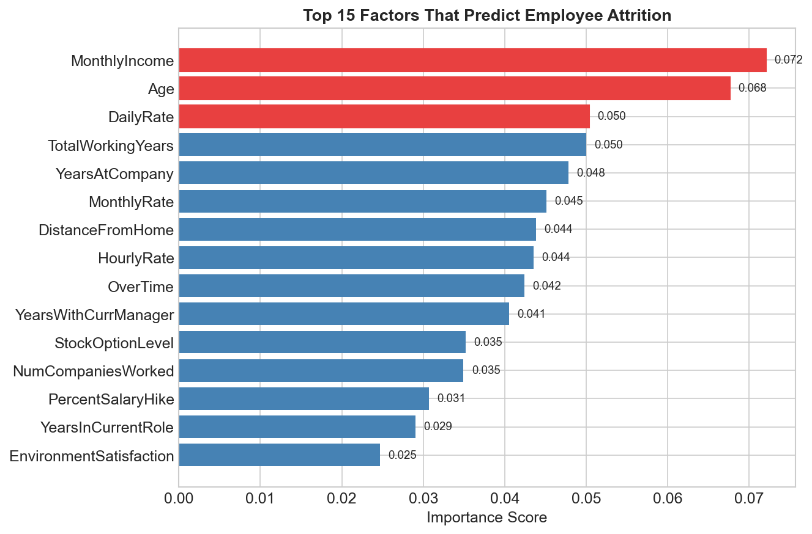
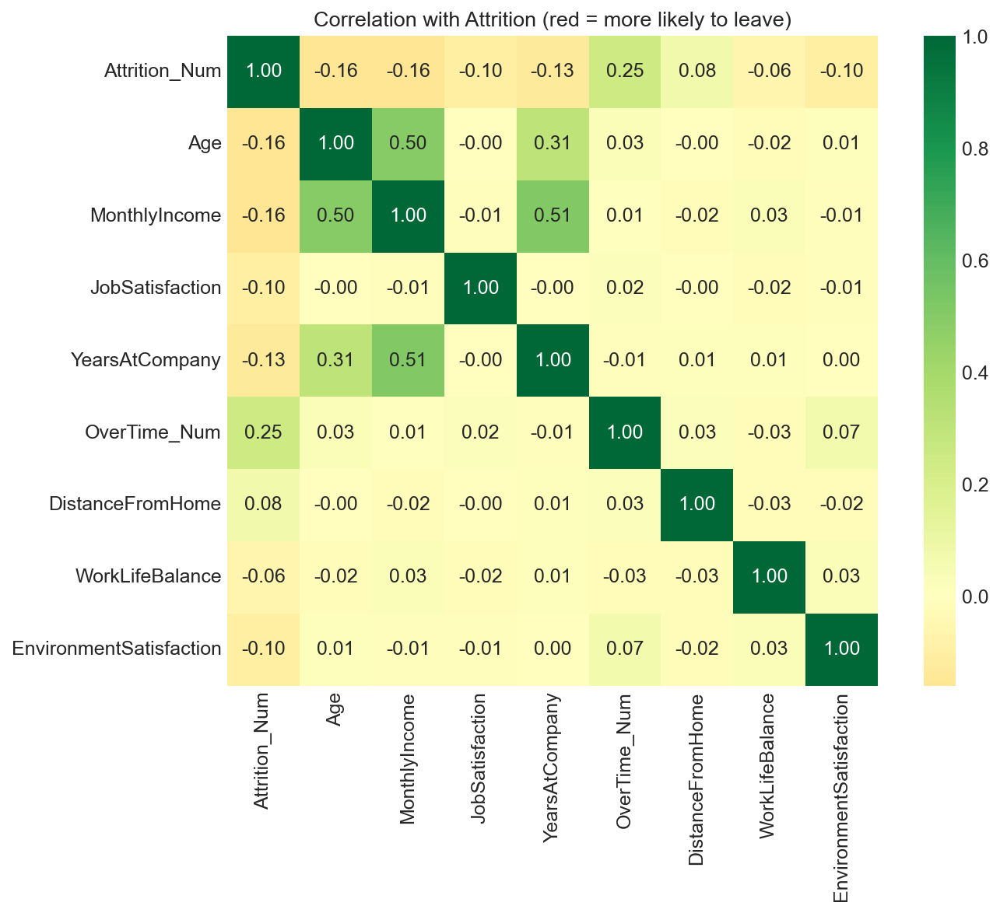

# 👔 HR Employee Attrition Analytics

## 🧩 The Business Problem
A company is losing **16.1% of its workforce annually**, costing an estimated
$2–3M in hiring, onboarding and lost productivity costs. This project analyses
IBM's HR dataset (1,470 employees) to answer two questions:
1. **Why** are employees leaving?
2. **Who** is most at risk of leaving next?

---

## 🔍 Key Findings

| Finding | Detail |
|---|---|
| 🚨 Overtime is the #1 risk factor | Overtime workers leave at **30.6%** vs **10.6%** for non-overtime workers — 3× higher |
| 💰 Low earners leave most | Median salary of leavers: **$3,202** vs **$5,204** for those who stayed |
| 🏢 Sales is the hardest-hit dept | Sales attrition: **20.6%** vs R&D at just **13.8%** |
| 🤖 ML model confirms income is top driver | MonthlyIncome scored **0.072** importance — the highest of all 35 features |

---

## 💡 Business Recommendations

1. **Cap mandatory overtime** — introduce comp-time or hiring to reduce overtime dependency
2. **Benchmark salaries for Sales roles** — 20.6% attrition signals a compensation gap
3. **Target retention efforts at low earners** — employees earning under $3k/month
   are the highest flight risk
4. **Use the ML model monthly** — score current employees to flag at-risk individuals
   before they resign

---

## 📊 Dashboard & Charts

### Power BI Dashboard


### Attrition by Department


### Overtime vs Attrition (Key Insight)


### Salary Distribution: Leavers vs Stayers


### Top 15 Attrition Predictors (ML Model)


### Correlation Heatmap


---

## 🤖 Machine Learning Model

| Detail | Result |
|---|---|
| Algorithm | Random Forest Classifier |
| Training data | 1,176 employees (80%) |
| Test data | 294 employees (20%) |
| **Accuracy** | **84.7%** |
| Top predictor | MonthlyIncome (0.072) |
| 2nd predictor | Age (0.068) |
| 3rd predictor | DailyRate (0.050) |

The model can correctly predict whether an employee will leave
in **85 out of 100 cases** — actionable for real HR departments.

---

## 🛠️ Technical Stack

| Layer | Tool | Purpose |
|---|---|---|
| Data Source | IBM HR Dataset (Kaggle) | 1,470 employee records |
| Data Extraction | SQL (pandasql) | Queried attrition by dept, salary, age, satisfaction |
| Data Cleaning | Python + Pandas | Encoding, null checks, feature engineering |
| Visualisation | Matplotlib + Seaborn | 5 publication-ready charts |
| ML Model | Scikit-learn (Random Forest) | Predicts attrition risk |
| Dashboard | Power BI | Interactive 5-visual dashboard with slicers |
| Version Control | Git + GitHub | Full project documentation |

## 📁 Project Structure

```
hr-attrition-analytics/
│
├── 📓 notebooks/
│   └── hr_analysis.ipynb
│
├── 📊 powerbi/
│   └── HR_Dashboard.pbix
│
├── 📈 charts/
│   ├── chart_dept.png
│   ├── chart_overtime.png
│   ├── chart_salary.png
│   ├── chart_heatmap.png
│   └── chart_feature_importance.png
│
├── 🗄️ data/
│   ├── sql_dept.csv
│   ├── sql_salary.csv
│   ├── sql_age.csv
│   └── sql_satisfaction.csv
│
└── README.md
```

---

## 📂 Dataset
IBM HR Analytics Employee Attrition Dataset —
available free on [Kaggle](https://www.kaggle.com/datasets/pavansubhasht/ibm-hr-analytics-attrition-dataset)

---

## 👤 About
Built as a portfolio project demonstrating end-to-end data analytics skills:
SQL → Python → Machine Learning → Business Storytelling
